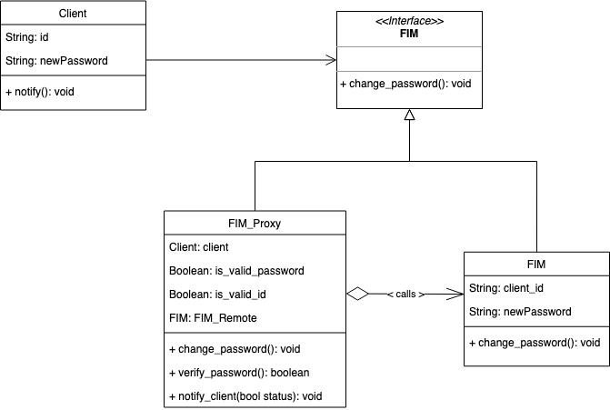
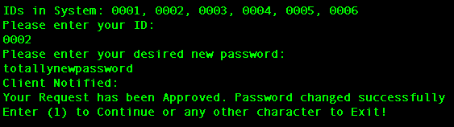
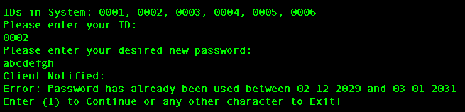
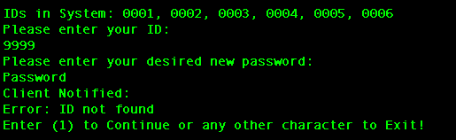

# Introduction

## Background Information
The Proxy Pattern is a structural design pattern that provides a surrogate or placeholder for another object to control access to it. It is used when we want to provide a simplified interface to a complex or resource-intensive object, or when we want to add additional functionality to an object while maintaining the same interface.

The Proxy Pattern can be used to solve a variety of problems, including controlling access to sensitive resources, providing caching for frequently accessed data, or adding logging or other instrumentation to an object. 

One of the key benefits of the Proxy Pattern is that it allows us to decouple the client code from the implementation details of the object being proxied. This makes it easier to change or replace the underlying object without affecting the client code. Additionally, the Proxy Pattern can help improve system performance by reducing the number of expensive resource requests and minimizing network traffic.

## Relating to the Assignment
For this assignment, we implement the Proxy Pattern to provide an intermediary between the client and a valuable resource, which is the FIM Remote Server. The intermediary, which is the proxy, acts as an interface for the FIM system to handle the validation of the password change request made by the client.

The usage of the Proxy Pattern serves a crucial purpose since it minimizes the communication with the FIM, and performs local verification of the password to ease the load on the FIM as well. The Proxy uses a local file containing records of user IDs, passwords, and dates of usage. If the proposed password from the client is fresh, the proxy will connect with the FIM system to update the client password. If the new password has been used before, the proxy system will notify the client that their request is not possible due to the previous usage of the password. The proxy will also provide the dates of the password usage.

Overall, the Proxy Pattern is a valuable design pattern that allows an intermediary to control access to valuable resources. In this assignment, we utilised the proxy for local password verification, which reduces the FIM system load and increases its security and availability. 

 

# Class Diagram

## Notes on the Diagram
- Both the FIM_Proxy and FIM implement the FIM Interface. This allows the client to treat the proxy just like the real FIM server.
- The proxy keeps a reference to the FIM Remote Server, so it can forward requests to the FIM when necessary
- The FIM does the "real work" of actually changing the client password. The proxy controls access to it

 

# How to Run Program

## Option 1: Run with JAR Executable
- cd into `A2_Mohamed/Executable`
- run `java -jar A2_Mohamed.jar`
 (NOTE: JAR Requires Java Runtime 55, which is Java 11 )
- Available Client IDs: 0001, 0002, ... , 0006
- Use Local_Record.txt/Password.txt in `A2_Mohamed/Executable` to test the program
- NOTE: If you execute the JAR file, the corresponding text files are located in its directory (A2_Mohamed/Executable). This is where the JAR file reads the txt files, not the files in root directory

## Option 2: Run though Intellij 
_Backup Option if JAR File fails_
- Run File `Main.java` in the IDE
- The Program will read the files Local_Record.txt / Password.txt from Project Root Directory
- __Note__: App is built using Java 11 

 

# Sample Program Outputs

## Success Password Change

Figure 1. For Client ID _0002_, __totallynewpassword__ is a fresh password. Proxy verifies client password and FIM changes password in Passwords.txt

 

## Previously Used Password

Figure 2. Client 0002 already used password (abcdefgh) between 02-12-2029 and 03-01-2031. Proxy does not permit password change & notifies client. Remote FIM not called.

 

## Invalid Client ID

Figure 3. Client 9999 does not exist. Error handled by FIM Proxy. Remote FIM not called.

 
 

# References 
- https://refactoring.guru/design-patterns/proxy
- https://www.geeksforgeeks.org/proxy-design-pattern/
- https://cs.uwaterloo.ca/~m2nagapp/courses/CS446/1195/Arch_Design_Activity/Proxy.pdf

